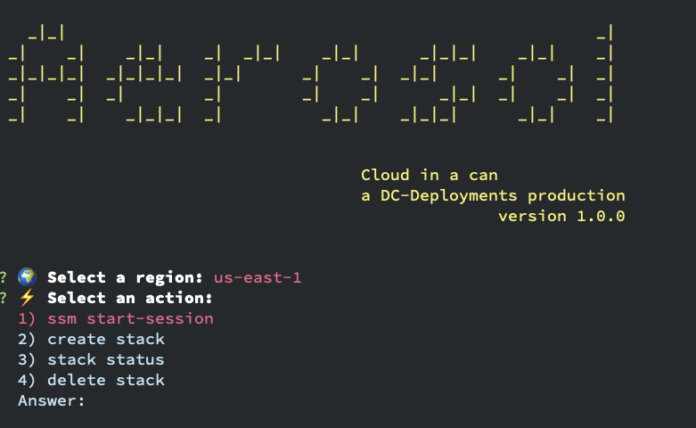

# Aerosol
> A CLI tool for simplifying the management of Atlassian AWS QuickStarts 
>
[](contributing.md)

<br />
<p align="center">
  
</p>

Current version: **1.0.0**

## Table of content

 - [Installation](#install)
 - [Description](#description)
 - [Usage](#usage)

## Install
From the root directory of this cloned repo run:

```bash
npm install
```

## Run
To run

```bash
node .
``` 

## Description
Aerosol is a work in progress. As of now it will let you manage Jira, Confluence, BitBucket and Crowd AWS CloudFormation stacks. Using Aerosol you can; create, delete and view the current status of a stack. Aerosol also allows you to easily open an ssm session to the associated EC2 instances for a stack.

## AWS Account auth
Aerosol requires an `AWS_ACCESS_KEY_ID` and `AWS_SECRET_ACCESS_KEY` to interact with CloudFormation. Authenticate to your AWS account using your favoured authentication mechanism. These tokens must then be added to `~/.aws/credentials`. More info on this topic can be found [here](https://docs.aws.amazon.com/cli/latest/userguide/cli-configure-files.html)
